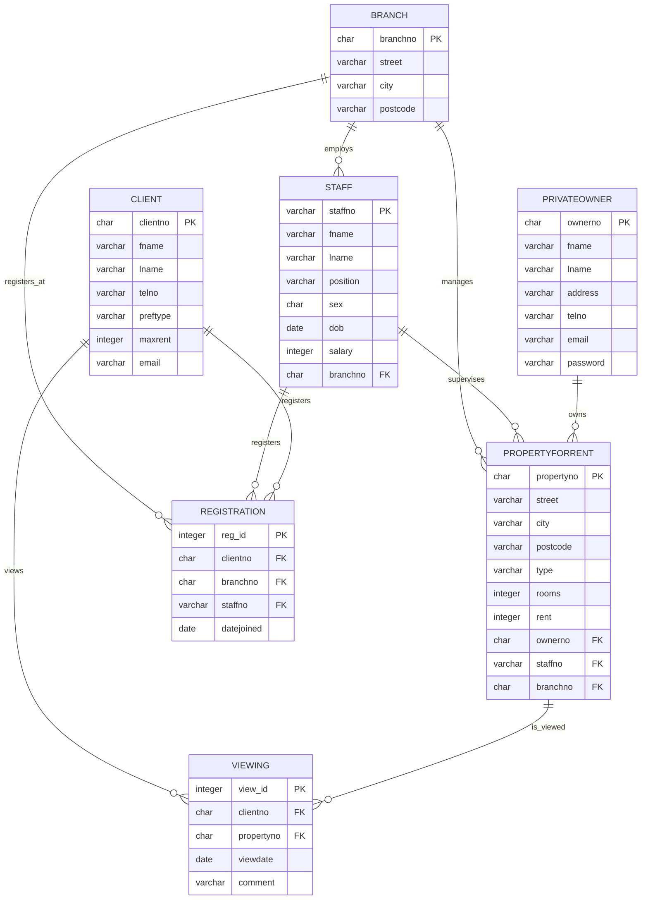

# 🏠 Dreamhome schema

This is an **entity relationship diagram** providing a clear visual representation of the DreamHome database structure, showing how the different entities are related to each other. It can be particularly useful for understanding the overall structure of the database at a glance and for identifying potential areas for queries or analysis.

## Interpreting the Entity Relationship diagram

Here's an explanation of the diagram:

1. Entities: Each table in the database is represented as an entity (box) in the diagram.

2. Attributes: The attributes (columns) of each entity are listed within the entity box. The data type of each attribute is also specified.

3. Primary Keys: Primary keys are indicated with "PK" after the attribute name.

4. Foreign Keys: Foreign keys are indicated with "FK" after the attribute name.

5. Relationships: The lines between entities represent relationships. The symbols at the ends of these lines indicate the type of relationship:

   - `||--o{` means "one-to-many" relationship
   - For example, `BRANCH ||--o{ STAFF : employs` means one branch can employ many staff members

6. Relationship Labels: The text on the relationship lines describes the nature of the relationship (e.g., "employs", "owns", "views").

